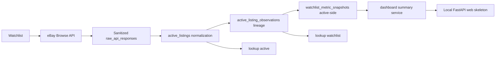

# SellThrough

SellThrough is a local-first Python application for learning and practicing
data engineering through eBay resale market intelligence. The project focuses
on API integration, sanitized raw-first ETL storage, SQLite data modeling,
normalized analytics surfaces, watchlist-driven ingestion, CLI workflows, and a
cautious local web/dashboard foundation.

## Architecture Status

Current pipeline:

```text
Watchlist -> Browse API -> raw_api_responses -> active_listings
          -> active_listing_observations -> watchlist_metric_snapshots
          -> lookup active / lookup watchlist
```

SellThrough currently supports watchlist-driven active listing ingestion,
active observation lineage, active-side watchlist metric snapshots, local lookup
summaries, a dashboard summary service, and a local FastAPI web skeleton.

Pending capabilities are explicit: Marketplace Insights approval, sold listing
ingestion, sold listing normalization, sold-side snapshots, sell-through
scoring, opportunity ranking, hosted deployment, native mobile work, and real
trend charts that combine active and sold snapshots.

## Architecture Diagram



Active-side snapshots exist. Full sell-through analytics do not exist yet.

## Current Status

- Production OAuth access: verified
- Browse API active listings: verified
- Taxonomy API: verified
- Marketplace Insights API: pending Application Growth Check approval
- Finding API: intentionally not used; it has been decommissioned

## Design Docs

- [Design document v0.3](docs/design-document-v0.3.md)
- [Agile workflow](docs/agile-workflow.md)
- [Self-audit against original design](docs/self-audit-2026-05-12.md)
- [eBay API design notes](docs/ebay-api-design.md)
- [Raw storage design](docs/raw-storage-design.md)
- [CLI smoke command](docs/cli-smoke-command.md)
- [Codex handoff notes](docs/codex-handoff.md)
- [Security hardening guide](docs/security-hardening.md)
- [Future wishlist](docs/future-wishlist.md)
- [Service layer](docs/service-layer.md)
- [Watchlist design](docs/watchlist-design.md)
- [Active polling design](docs/active-polling-design.md)
- [Lookup command](docs/lookup-command.md)
- [Frontend architecture roadmap](docs/frontend-roadmap.md)
- [Metric snapshots design](docs/metric-snapshots-design.md)
- [Brand guidelines](docs/brand-guidelines.md)
- [Validation notes](docs/validation-notes.md)

## Local Setup

Requires Python 3.11+.

```powershell
python -m venv .venv
.\.venv\Scripts\Activate.ps1
python -m pip install -e .
```

Create local environment variables from `.env.example`. Do not commit real
credentials.

```powershell
setx EBAY_CLIENT_ID "your-production-app-id"
setx EBAY_CLIENT_SECRET "your-production-cert-id"
setx EBAY_DEV_ID "your-dev-id"
setx EBAY_ENV "production"
```

Initialize the local SQLite database:

```powershell
python -m sellthrough db init
```

Most local commands can run without live eBay credentials. Commands that call
eBay directly, such as `browse search`, `smoke`, and `watchlist poll-active`,
require Browse API credentials in the environment.

## Current Demo Flow

This flow demonstrates the current active-side pipeline. The `poll-active`
step requires eBay Browse credentials; the setup, listing, lookup, snapshot, and
web inspection commands use local SQLite state.

```powershell
python -m sellthrough db init
python -m sellthrough config check
python -m sellthrough watchlist add "DeWalt 20V drill" --query "dewalt 20v drill"
python -m sellthrough watchlist list
python -m sellthrough watchlist poll-active --limit 25
python -m sellthrough watchlist capture-snapshots
python -m sellthrough lookup watchlist 1 --samples 5
python -m sellthrough web serve
```

Install optional web dependencies with `python -m pip install -e .[web]` before
running `web serve`.

### Example Output

`python -m sellthrough watchlist list`

```text
ID      Active  Label               Query               Category ID  Added
1       yes     DeWalt 20V drill    dewalt 20v drill    184655       2026-05-12 17:41:58
```

`python -m sellthrough lookup watchlist 1 --samples 5`

```text
Watchlist: DeWalt 20V drill
Query: dewalt 20v drill
Active listings: 25
Latest poll: 2026-05-12 17:42:10
Sold metrics: pending Marketplace Insights access
Active price range: 44.99 - 129.99 USD
Median active price: 82.50 USD

Sample listings:
1. DeWalt 20V MAX XR Drill Kit
   89.99 USD | condition=Used
   item_id=v1|1234567890|0 | last_seen=2026-05-12 17:42:10
```

`python -m sellthrough watchlist capture-snapshots`

```text
Watchlist ID     Active Count    Active Median    Confidence    Captured At
1                25              82.50            medium        2026-05-12 17:43:03
```

`python -m sellthrough web serve`

```text
INFO:     Uvicorn running on http://127.0.0.1:8000
INFO:     Open /health, /dashboard, /watchlist, /lookup
```

## Command Reference

Run a live Browse API smoke search:

```powershell
python -m sellthrough browse search "dewalt drill" --limit 3
```

Save the raw Browse response page while searching:

```powershell
python -m sellthrough browse search "dewalt drill" --limit 3 --save-raw
```

Run the first end-to-end smoke command:

```powershell
python -m sellthrough smoke --query "dewalt drill" --limit 1
```

Check the default eBay category tree:

```powershell
python -m sellthrough taxonomy default-tree --marketplace EBAY_US
```

Check Marketplace Insights access after eBay approval:

```powershell
python -m sellthrough insights search "dewalt drill" --days-back 30 --limit 5
```

Add and inspect watchlist rows:

```powershell
python -m sellthrough watchlist add "DeWalt 20V drill" --query "dewalt 20v drill" --category-id 184655
python -m sellthrough watchlist list
```

Poll active watchlist rows through Browse, save sanitized raw pages, and upsert
normalized `active_listings` rows:

```powershell
python -m sellthrough watchlist poll-active --limit 25
python -m sellthrough watchlist capture-snapshots
```

Query normalized active listings:

```powershell
python -m sellthrough lookup active "dewalt drill" --samples 5
python -m sellthrough lookup watchlist 1 --samples 5
```

Run the local web skeleton (optional dependencies):

```powershell
python -m pip install -e .[web]
python -m sellthrough web serve
```

Initial web routes:

- `/health`
- `/dashboard`
- `/watchlist`
- `/lookup`

## Learning-First Development Standard

SellThrough is intentionally both a working tool and a learning model for data
analytics/data engineering practice. Every feature should leave behind enough
context for a developing data professional to understand why the code exists,
how data moves through it, and what tradeoffs were made.

Project documentation expectations:

- Keep external design notes in `docs/` when adding new subsystems, workflows,
  schemas, or API integrations.
- Use dense, readable inline comments around non-obvious logic, data modeling
  choices, API quirks, and failure handling.
- Prefer short explanatory comments over narration of obvious Python syntax.
- Update this README when setup, commands, or project status changes.
- Keep generated files, credentials, local databases, caches, and build outputs
  out of Git and prune them from the working folder when they are no longer
  needed.

## Development Workflow

Active development happens on `test-main`.

`main` is the stable release branch.

Feature PRs target `test-main`.

Release PRs move `test-main` to `main`.

Releases use version tags; current version starts at `0.1.0`.

See `docs/agile-workflow.md` for the full branch/release/validation process.

## Portfolio Summary

SellThrough demonstrates a local-first data engineering workflow: API
ingestion, raw-first storage, SQLite modeling, normalization, observation
lineage, active-side metric snapshots, CLI workflows, and a local FastAPI
dashboard skeleton. Sold-side analytics and opportunity scoring are
intentionally pending until Marketplace Insights access and sold-listing
normalization are available.

## Security Checks

Credential rotation guidance is tracked in
`docs/security-hardening.md#credential-rotation-checklist`.

Before pushing, run a quick local scan:

```powershell
rg -n "access_token|client_secret|Authorization|Bearer|gho_|EBAY_CLIENT_SECRET|password|payment|buyer|seller|username" .
```

CI workflows:

- `.github/workflows/ci.yml` runs on push/pull_request and executes:
  - `python -m unittest`
  - `python -m pytest tests/test_e2e_v1_validation.py -q` (offline/mock-based V1 flow validation)
  - `python -m pytest tests/test_services.py -q` (web/dashboard route-service validation)
  - high-signal secret scan
  - `pip-audit`
- `.github/workflows/security-checks.yml` remains as a dedicated security-focused check pipeline.

Security hooks enforced in CI include:

- `rg`-based secret pattern scan (focused on high-signal token/secret patterns)
- `pip-audit` dependency vulnerability audit

If either check fails, resolve it before merging.
